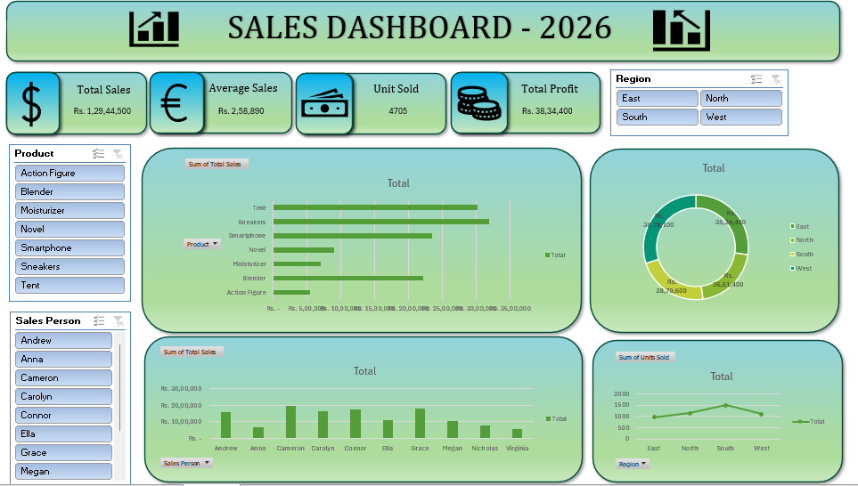

# 📊 Sales Dashboard - 2026

An interactive **Sales Dashboard** built in **Microsoft Excel** to analyze sales performance across different products, salespersons, and regions. The dashboard provides key business insights using Pivot Tables, Pivot Charts, Slicers, and KPI cards.

---

## 📷 Dashboard Preview

> Save the dashboard screenshot as **dashboard.png** inside the project folder.



---

## 🚀 Features

- 📈 Total Sales KPI
- 💰 Total Profit KPI
- 💵 Average Sales KPI
- 📦 Units Sold KPI
- 📊 Product-wise Sales Analysis
- 👨‍💼 Salesperson Performance
- 🌍 Region-wise Sales Distribution
- 📉 Units Sold by Region
- 🎯 Interactive Slicers for:
  - Product
  - Sales Person
  - Region

---

## 🛠️ Tools Used

- Microsoft Excel
- Pivot Tables
- Pivot Charts
- Slicers
- Doughnut Chart
- Bar Chart
- Column Chart
- Line Chart
- Conditional Formatting
- Shapes & Icons

---

## 📊 Dashboard KPIs

| KPI | Description |
|------|-------------|
| Total Sales | Displays the overall revenue generated |
| Average Sales | Average sales value |
| Units Sold | Total quantity of products sold |
| Total Profit | Overall profit earned |

---

## 📈 Dashboard Visualizations

- Product-wise Total Sales (Horizontal Bar Chart)
- Region-wise Sales Distribution (Doughnut Chart)
- Salesperson Performance (Column Chart)
- Units Sold by Region (Line Chart)

---

## 🎯 Filters Available

- Product
- Sales Person
- Region

All charts update automatically based on the selected slicer values.

---

## 📂 Project Structure

```text
Excel dashboard/
│
├── Sales dashboard.xlsx
├── dashboard.png
└── README.md
```

---

## ▶️ How to Use

1. Download or clone this repository.
2. Open **Sales dashboard.xlsx** using Microsoft Excel (2016 or later recommended).
3. Enable Editing if prompted.
4. Use the slicers to filter data by:
   - Product
   - Sales Person
   - Region
5. Analyze the updated charts and KPIs.

---

## 📌 Dashboard Highlights

- Clean and professional layout
- Interactive filtering
- Dynamic Pivot Charts
- Business KPI cards
- Easy-to-understand visualizations
- Suitable for portfolio and resume projects

---

## 📷 Screenshot


---

## 📚 Skills Demonstrated

- Microsoft Excel
- Data Cleaning
- Pivot Tables
- Pivot Charts
- Dashboard Design
- Data Visualization
- KPI Reporting
- Business Analytics

---

## 👨‍💻 Author

**Sangameshwaran B**

---
